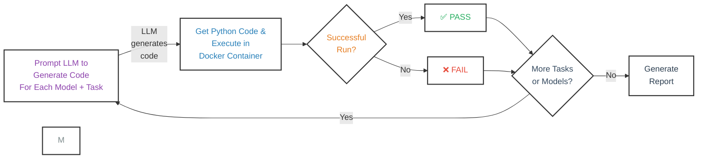

# Weaviate Vibe Check

Evaluate LLMs on their ability to generate correct Weaviate code in zero-shot and few-shot scenarios.

## How it works

This repo contains a script `check_weaviate_vibes.py` that runs a set of benchmarks on a given LLM.

Each benchmark includes a task and a canonical implementation. The LLM is scored on its ability to generate correct Weaviate code for each task.

The generated task is run through a Docker container to automatically check the code, and the results are saved to the `results` directory.

There are variants of each benchmark, so that the LLM can be evaluated on its ability to generate correct Weaviate code as a zero-shot, or with various types of in-context examples.

## Supported Models

- API-based: OpenAI, Anthropic, Claude, Gemini
- Local: Ollama-based models (planned)

## Benchmark Tasks

- Connect to Weaviate Cloud
- Create and manage collections
- Batch import
- Querying (semantic, filters, hybrid)

## Setup

```bash
# Clone repository
git clone git@github.com:weaviate-tutorials/weaviate-vibe-eval.git
cd weaviate-vibe-eval

# Set up environment
# Install uv (https://docs.astral.sh/uv/getting-started/installation/)
uv sync
source .venv/bin/activate
# This should install all main dependencies - if not, see requirements.txt / pyproject.toml

# Set environment variables
# Create a .env file with your API keys:
# ANTHROPIC_API_KEY=your_key
# COHERE_API_KEY=your_key
# GEMINI_API_KEY=your_key
# OPENAI_API_KEY=your_key
# WCD_TEST_URL=your_weaviate_cloud_url
# WCD_TEST_KEY=your_weaviate_api_key

# Build docker image
See [docker/README.md](docker/README.md)
```

## Usage

```bash
# Run all benchmarks
python check_weaviate_vibes.py

# Run specific tests
# (See documentation for additional options)
```

## Project Structure

```
weaviate_vibe_eval/       # Main package
  ├── benchmarks/         # Benchmark definitions and runner
  ├── models/             # LLM provider implementations
  └── utils/              # Shared utilities (Docker, code execution)
tests/                    # Test suite
docker/                   # Docker environment for safe code execution
results/                  # Benchmark results output
```

## (Rough) Diagram

This diagram roughly represents how the repo works. View it on Mermaid (https://mermaid.js.org/)



## License
MIT License
